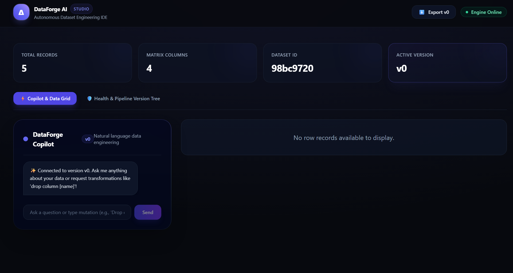

DataForge AI is an AI-powered Dataset Engineering IDE that helps machine learning practitioners automatically inspect, clean, repair, and improve datasets before model training.

Instead of acting as a simple preprocessing tool, DataForge AI serves as an intelligent assistant that understands the dataset, identifies potential quality issues, recommends evidence-based fixes, and allows users to interactively apply improvements while maintaining a complete history of every change.

Users upload a dataset (initially focusing on either image datasets or tabular datasets), and the platform performs a comprehensive analysis that includes detecting duplicates, mislabeled samples, missing values, class imbalance, data leakage, outliers, and other quality problems. Rather than only reporting these issues, the system explains why they matter, estimates their impact on downstream model performance, and recommends the most appropriate solutions.

Users can review each suggested modification, selectively apply repairs, compare different dataset versions, and export both the cleaned dataset and a reproducible preprocessing pipeline for future use.


Core Features

Upload and analyze machine learning datasets.
Automatically detect data quality issues such as:
Duplicate and near-duplicate samples
Missing values
Outliers
Class imbalance
Data leakage
Suspicious or mislabeled samples
AI-powered explanations and repair recommendations.
One-click or selective dataset cleaning.
Interactive Dataset Health Dashboard with quality metrics.
Dataset version history (similar to Git) to track every modification.
Estimated impact of each cleaning step on model quality.
Export the cleaned dataset, preprocessing pipeline, and quality report.

Frontend:** React, TypeScript, Tailwind CSS, Vite
Backend:** Python, FastAPI (supporting CSV, Excel, and Parquet data formats)

1. Prerequisites
Make sure you have **Node.js** and **Python** installed in your environment (or run it seamlessly inside **GitHub Codespaces**).

2. Installation & Running

* **Backend Setup:**
  ```bash
  pip install -r requirements.txt
  uvicorn main:app --reload

## Project Gallery & Screenshots

### 1. Overview


### 2. Studio Interface


### 3. Health Diagnostics


### 4. Pipeline & Version Control


### 5. AI Copilot Integration


